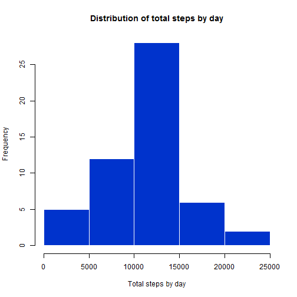
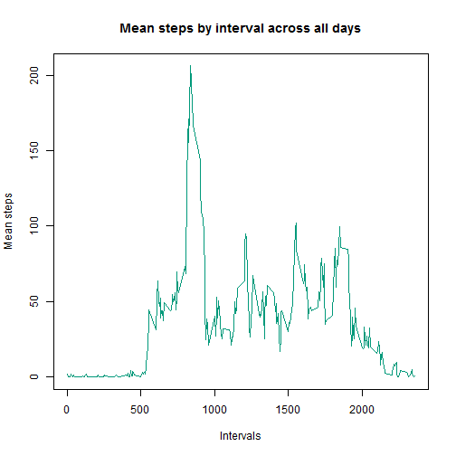
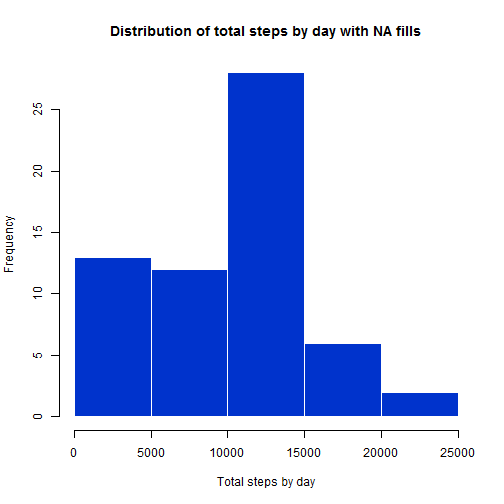
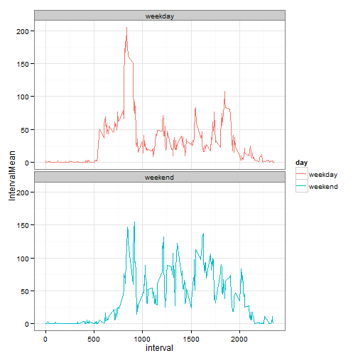

# Peer Assessment one: Personal Activity Monitoring


## Loading and preprocessing the data


```r
activity<-read.csv(unzip("activity.zip"))
activity<-transform(activity,date=as.Date(date,"%Y-%m-%d"))
```

## What is mean total number of steps taken per day?

- Make a histogram of the total number of steps taken each day


```r
library(dplyr)
activityComplete<-activity[complete.cases(activity),]

stepsDay<-group_by(activityComplete,date) %>% summarise(DayTotal=sum(steps))

hist(stepsDay$DayTotal, col="#0033CC", border="white", xlab="Total steps by day",
     main="Distribution of total steps by day")
```

 

- Calculate and report the mean and median total number of steps taken per day


```r
mean(stepsDay$DayTotal)
```

```
## [1] 10766
```

```r
median(stepsDay$DayTotal)
```

```
## [1] 10765
```

## What is the average daily activity pattern?

- Make a time series plot (i.e. type = "l") of the 5-minute interval (x-axis) and the average number of steps taken, averaged across all days (y-axis)


```r
stepsInterval<-group_by(activityComplete,interval) %>% summarise(IntervalMean=mean(steps))
plot(stepsInterval$interval, stepsInterval$IntervalMean, type="l", col="#00997A",
     xlab="Intervals", ylab="Mean steps", main="Mean steps by interval across all days")
```

 

- Which 5-minute interval, on average across all the days in the dataset, contains the maximum number of steps?


```r
stepsInterval[which.max(stepsInterval$IntervalMean),]
```

```
## Source: local data frame [1 x 2]
## 
##   interval IntervalMean
## 1      835        206.2
```

## Imputing missing values

- Calculate and report the total number of missing values in the dataset (i.e. the total number of rows with NAs)


```r
table(complete.cases(activity))
```

```
## 
## FALSE  TRUE 
##  2304 15264
```

- Devise a strategy for filling in all of the missing values in the dataset. The strategy does not need to be sophisticated. For example, you could use the mean/median for that day, or the mean for that 5-minute interval, etc.


```r
imputation<-function(dat){
  dat[is.na(dat$steps),"steps"]<-median(dat$steps,na.rm=T)
  dat
}
```

- Create a new dataset that is equal to the original dataset but with the missing data filled in.


```r
activityImput<-group_by(activity,interval) %>% do(imputation(.))
head(activityImput)
```

```
## Source: local data frame [6 x 3]
## Groups: interval
## 
##   steps       date interval
## 1     0 2012-10-01        0
## 2     0 2012-10-02        0
## 3     0 2012-10-03        0
## 4    47 2012-10-04        0
## 5     0 2012-10-05        0
## 6     0 2012-10-06        0
```

- Make a histogram of the total number of steps taken each day and Calculate and report the mean and median total number of steps taken per day. Do these values differ from the estimates from the first part of the assignment? What is the impact of imputing missing data on the estimates of the total daily number of steps? 


```r
stepsDayNAfills<-group_by(activityImput,date) %>% summarise(DayTotal=sum(steps))

hist(stepsDayNAfills$DayTotal, col="#0033CC", border="white", xlab="Total steps by day", main="Distribution of total steps by day with NA fills")
```

 

```r
mean(stepsDayNAfills$DayTotal)
```

```
## [1] 9504
```

```r
median(stepsDayNAfills$DayTotal)
```

```
## [1] 10395
```


The new data looks based to zero

## Are there differences in activity patterns between weekdays and weekends?

- Create a new factor variable in the dataset with two levels - "weekday" and "weekend" indicating whether a given date is a weekday or weekend day.


```r
Sys.setlocale("LC_TIME", "English")
```

```
## [1] "English_United States.1252"
```

```r
day<-weekdays(activityImput$date)
day[day %in% c("Monday","Tuesday","Wednesday","Thursday","Friday")]<-"weekday"
day[day %in% c("Saturday","Sunday")]<-"weekend"

activityImput$day<-day
```

- Make a panel plot containing a time series plot (i.e. type = "l") of the 5-minute interval (x-axis) and the average number of steps taken, averaged across all weekday days or weekend days (y-axis).


```r
stepsIntervalday<-group_by(activityImput,day,interval) %>% summarise(IntervalMean=mean(steps))
library(ggplot2)
p<-ggplot(stepsIntervalday,aes(x=interval,y=IntervalMean,colour=day))
p<-p+geom_line()+facet_wrap(~day,nrow=2)
p<-p+theme_bw()
p
```

 


